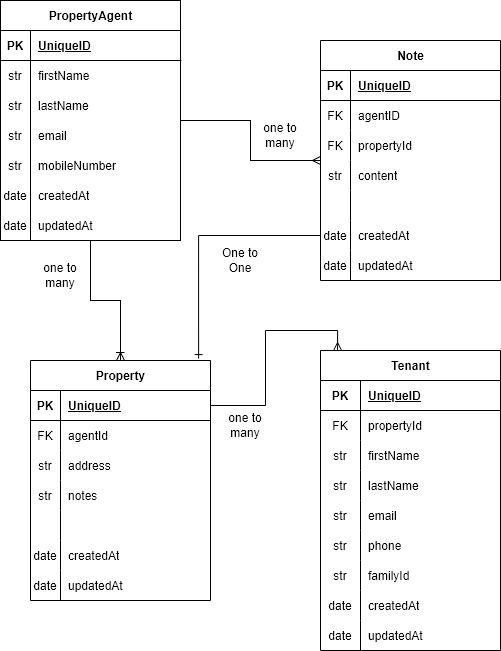

# NestJS Notes Management API

This project is a simple Notes Management API built with NestJS. It is designed for technical interview tests and demonstrates the implementation of CRUD operations for managing notes, properties, agents, and tenants.

## Features

- Create, Read, Update, and Delete (CRUD) operations for Notes.
- Integration with an in-memory database for simplicity.
- Relationships between Notes, Properties, and Agents.
- Modular and scalable architecture using NestJS.

## Installation

1. Clone the repository:
   ```bash
   git clone <repository-url>
   cd nest-pure-interview
   ```

2. Install dependencies:
   ```bash
   npm install
   ```

3. Start the application:
   ```bash
   npm run start
   ```

4. The API will be available at `http://localhost:3000`.

## API Endpoints

### Notes

- **Create a Note**  
  `POST /notes`  
  Request Body:
  ```json
  {
    "agentID": "string",
    "propertyId": "string",
    "content": "string"
  }
  ```

- **Get All Notes**  
  `GET /notes`

- **Get Note by ID**  
  `GET /notes/:id`

- **Update a Note**  
  `PUT /notes/:id`  
  Request Body:
  ```json
  {
    "agentID": "string",
    "propertyId": "string",
    "content": "string"
  }
  ```

- **Delete a Note**  
  `DELETE /notes/:id`

## Security Limitations

This project is designed for demonstration purposes and does not include authentication or authorization mechanisms. As a result:

1. **Unauthenticated Access**:  
   All API endpoints are publicly accessible without any authentication. This means anyone with access to the API can perform CRUD operations on the data.

2. **No Role-Based Access Control (RBAC)**:  
   There is no distinction between users or roles. All users have full access to all endpoints.

3. **Data Integrity Risks**:  
   Without authentication, there is no way to verify the identity of the user making the request. This could lead to unauthorized data modifications or deletions.

## Recommendations for Production

If this application is to be used in a production environment, the following security measures should be implemented:

1. **Authentication**:  
   Use JWT or OAuth2 to secure the API endpoints.

2. **Authorization**:  
   Implement role-based access control (RBAC) to restrict access to certain endpoints based on user roles.

3. **Input Validation**:  
   Ensure all incoming data is validated to prevent injection attacks.

4. **Rate Limiting**:  
   Add rate limiting to prevent abuse of the API.

5. **HTTPS**:  
   Use HTTPS to encrypt data in transit.

## Entity Relationship Diagram (ERD)


## 📘 Entities and Relationships

### 1. **PropertyAgent**
Represents agents who manage properties.

**Fields:**
- `UniqueID` (PK)
- `firstName` (string)
- `lastName` (string)
- `email` (string)
- `mobileNumber` (string)
- `createdAt` (date)
- `updatedAt` (date)

**Relationships:**
- One agent can manage **many properties** (1:N)
- One agent can write **many notes** (1:N)

---

### 2. **Property**
Represents the properties being managed.

**Fields:**
- `UniqueID` (PK)
- `agentId` (FK → PropertyAgent)
- `address` (string)
- `notes` (string)
- `createdAt` (date)
- `updatedAt` (date)

**Relationships:**
- Each property belongs to **one agent** (N:1)
- One property can have **many tenants** (1:N)
- One property can have **many notes** (1:N)

---

### 3. **Tenant**
Represents individuals renting a property.

**Fields:**
- `UniqueID` (PK)
- `propertyId` (FK → Property)
- `firstName` (string)
- `lastName` (string)
- `email` (string)
- `phone` (string)
- `familyId` (string)
- `createdAt` (date)
- `updatedAt` (date)

**Relationships:**
- Each tenant is associated with **one property** (N:1)

---

### 4. **Note**
Represents notes made by agents for properties.

**Fields:**
- `UniqueID` (PK)
- `agentID` (FK → PropertyAgent)
- `propertyID` (FK → Property)
- `content` (string)
- `createdAt` (date)
- `updatedAt` (date)

**Relationships:**
- Each note is written by **one agent** (N:1)
- Each note is linked to **one property** (N:1)

---

## 📌 Notes:
- `PK` = Primary Key
- `FK` = Foreign Key
- `str` = String data type
- `date` = Date data type
- Timestamp fields (`createdAt`, `updatedAt`) are used to track record history.

## License

This project is for educational and interview purposes only. It is not intended for production use.
